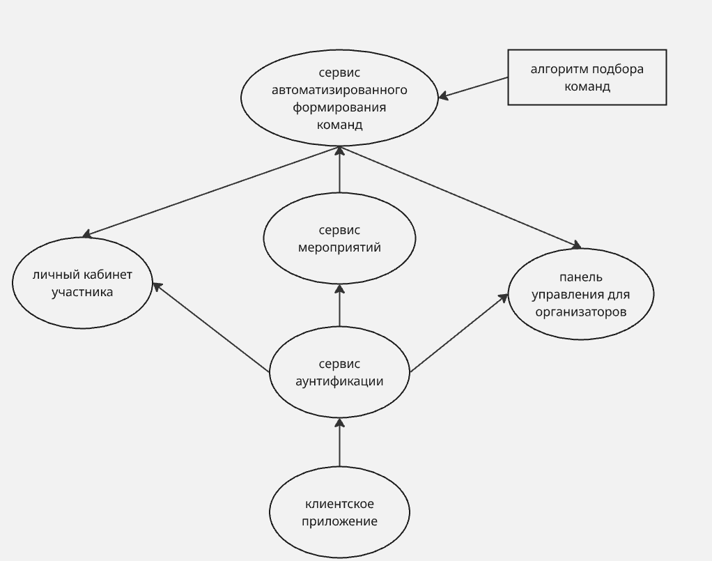

## Web-приложение для автоматизированного формирования проектных команд 

### Цель
Разработать полноценную систему автоматизированного формирования команд для проектной деятельности как внутри вуза, так и на различных мероприятиях на основе сопоставления компетенций участников с требованиями проектов.

### Задачи
1. разработать архитектуру web-приложения 
2. Разработать модуль авторизации и аутентификации на основе ролей пользователя
3. реализовать личный кабинет участника, в котором он сможет указать свои навыки, а также желаемые роли в команде
4. реализовать алгоритм автоматизированного формирования команд в зависимости от требований проекта и навыков участников
5. Разработать пользовательский интерфейс приложения
6. Разработать метрики оценки качества формирования команд

### Актуальность
Связи с распространением проектной деятельности в учебной среде, а также ростом популярности проведения различных хакатонов и командных соревнований, где такие методы, как: самостоятельный поиск команды или ручное распределение участников организатором оказываются неэффективными из-за больших временных затрат и несбалансированности составов.
Поэтому разработка автоматизированной системы, основанной на сопоставлении компетенций участников с требованиями проектов, позволит решить эти проблемы, повысив результативность команд.

### Ожидаемый результат
web-приложения с серверной и клиентской частью 

### Предпологаемая архетектура проекта

 
### Роадмап
- анализ требований и проектирование архитектуры
- проектирование API
- реализация системы аутентификации и CRUD endpoint`ов
- написание алгоритма формирования команд
- интеграция алгоритма в серверное приложение
- написание frontend`а и его интеграция с серверной частью
- покрытие приложения тестами
- оценка качества формирования команд и доработка алгоритма

